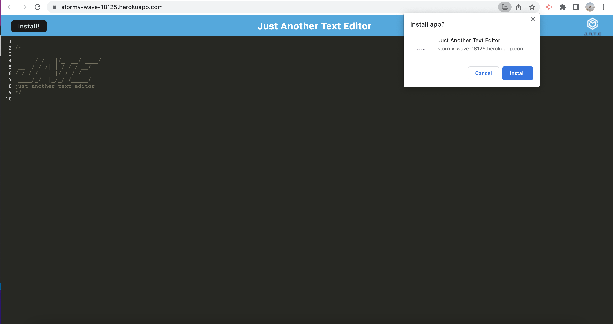
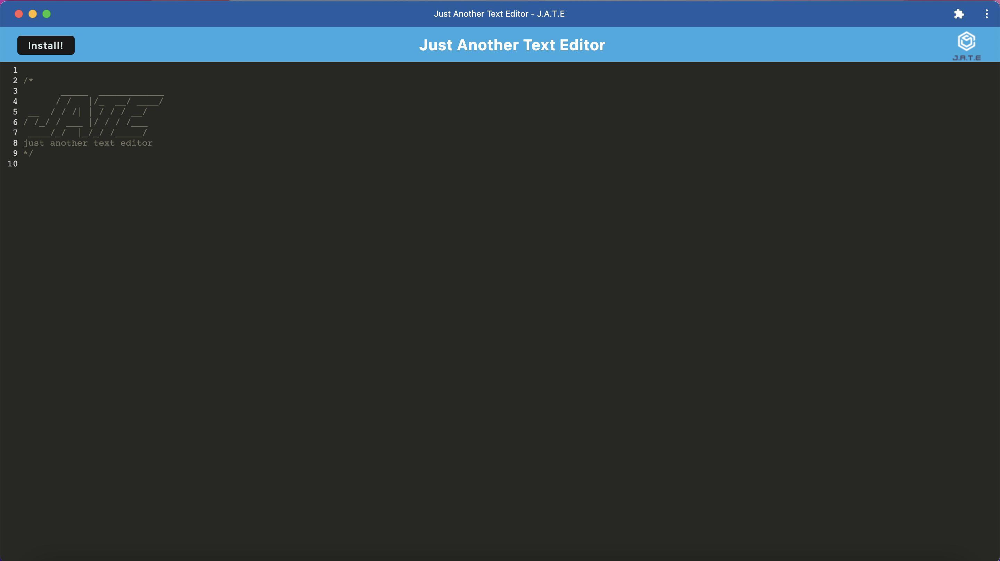

# editingText

## Description
I have created this text editor app as a PWA so that it can be used on or offline. Because I have built it using webpack.js It can actually be installed to your desk top.
I used Nodejs, Expressjs, Webpackjs and IndexedDB to make this program run.

## Installation
To install this application simply clone the repository and run ``npm install`` to install all the dependancies and dev dependancies needed to run this app. Once this is done then you can run ``npm run start:dev`` 

## Usage
Use this app as a text editor. Both on and offline.

Below is an image of the application that was deployed using heroku.js

If you would like to make this available on your desktop simply click the download button located in the web browser address bar it looks like a little computer icon with the downward facing arrow in it. When you click it a modal will drop down and ask you if you would like to install this app? click the Install button.

Once installed you can use it offline. If you look at the image below you can see what it looks like... See, no web browser address bar.

## Deployed Application
To see the deployed application <a href="https://stormy-wave-18125.herokuapp.com/">Click Here</a>

## Questions 
If you have any questions related to this application you can find my contact details at my <a href="https://github.com/skipsterling">Github</a> 